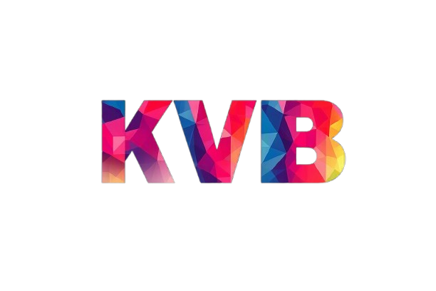

# KVB

**KVB** is a lightweight experimental Android browser built in Kotlin with Jetpack Compose Material 3, Material Icons, and Android WebView.

> **Important:** KVB is not recommended for daily use. It is an experimental, vibe-coded browser created in Kotlin with the Manus AI agent. It is intended for learning, experimentation, and testing rather than production browsing or security-critical use.

## Features

KVB includes configurable search engines, light and dark themes, persistent tabs, tab cleanup, homepage shortcuts, favicon-based shortcut icons, most-visited site tracking, compact mobile navigation, and WebView-based browsing.

## Repository and source status

This repository contains the current source code for the latest development state of KVB. Each release is built from the corresponding updated source commit on the `main` branch; the repository is not limited to the original code version.

## Releases

Download the latest debug APK from the [KVB releases page](https://github.com/M-Umar-2017/KVBrowser/releases). The current release is [KVB v2.3.0](https://github.com/M-Umar-2017/KVBrowser/releases/tag/v2.3.0).

The APK is debug-signed for testing. Android may require permission to install applications from the download source.

## Build from source

Open the project in Android Studio with the Android SDK installed, then build the `app` module using the debug configuration. The generated APK is placed under `app/build/outputs/apk/debug/`.

## Contributing

Feel free to fork this repository, open issues, suggest improvements, report bugs, or submit pull requests. Ideas, experiments, documentation updates, and code contributions are welcome.

## License and responsibility

KVB is released under the [MIT License](LICENSE). This project is shared as an experimental software project. Review the source before using it, do not rely on it for sensitive browsing, and keep Android and WebView components updated on the device.
